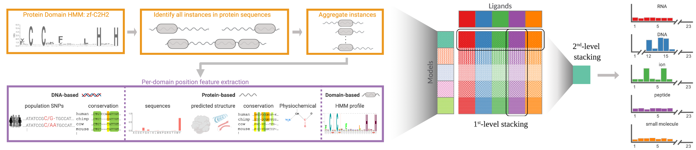
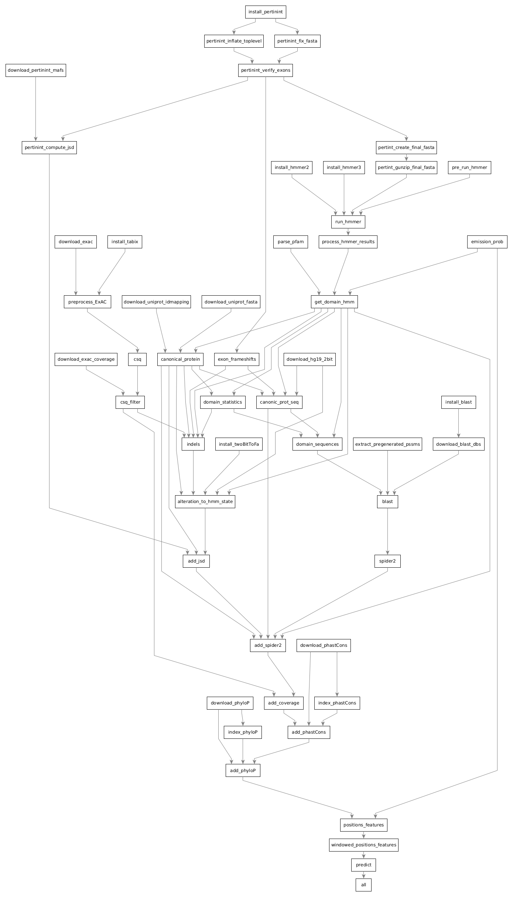

## dSPRINT

### A machine learning framework predicting interaction sites in human protein domains
Our dSPRINT predictor can run on **any** human Pfam protein domain, and return per-position predictions of interaction-sites for five different ligand types: DNA, RNA, ion, peptide, and small molecule. 



If you use data or scripts from this repository, please cite:

> Etzion-Fuchs A., Todd D.A. and Singh M., (2021) "dSPRINT: predicting DNA, RNA, ion, peptide and small molecule
interaction sites within protein domains", *Nucleic Acids Research* [https://doi.org/10.1093/nar/gkab356](https://doi.org/10.1093/nar/gkab356)

Given a domain input file: 1) all the required external datasets are downloaded, 2) features are calculated for each of the input domain positions, 3) our trained predictors are run and return per-position prediction results.

This repository can be used as a computation pipeline, and uses
[Snakemake](https://snakemake.readthedocs.io/en/stable/) as the underlying engine. 


Essentially, given a file [input.hmm](https://github.com/vineetbansal/dsprint-pipeline/blob/master/input.hmm), with one or multiple domains which follow the syntax of a
[Pfam-A entry](https://pfam.xfam.org/help), the following computational graph of rules is run:



Output files are generated in the `output` folder, with the final result per-position ligand binding score generated
in the file `output/binding_scores.csv`

```
        ligand_type     binding_score   domain  match_state
0       dna     0.9916359186172485      zf-C2H2 1
1       dna     0.9872528910636902      zf-C2H2 10
2       dna     0.997771143913269       zf-C2H2 11
3       dna     0.997983455657959       zf-C2H2 12
4       dna     0.9957016110420227      zf-C2H2 13
5       dna     0.9956439733505249      zf-C2H2 14
```

Read the [Getting Started](docs/00_getting_started.md) guide on how to run dSPRINT.
