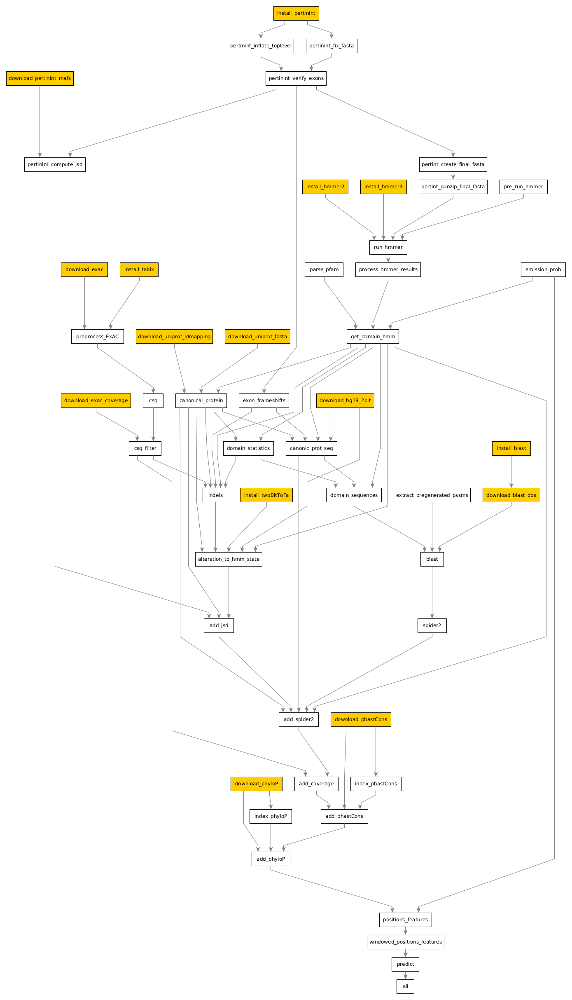

## Download data and utilities

The first step is to download all the required data and utilities that `dSPRINT` uses
in its pipeline. There are several steps (`rules`) of the pipeline that download data
from the web (and compile/install downloaded utilities if needed). These 15 rules are marked
in the rule graph below in orange.
  

 
These highlighted rules can be found in the
[Snakefile](https://github.com/vineetbansal/dsprint-pipeline/blob/master/Snakefile#L24)
towards the top and are referred to as
[Local Rules](https://snakemake.readthedocs.io/en/stable/snakefiles/rules.html#local-rules) in Snakemake
parlance, because when you run snakemake in a cluster environment, these rules are **automatically run on the head node
of the cluster**, since the head node is usually the onle with exclusive web connectivity.

Although in theory we can simply run:

```
snakemake --profile .
```

and these 15 rules will be executed automatically if needed (as indeed, will any other rules in the Snakefile), some of
these steps, especially the ones dealing with downloading and installing [BLAST](https://blast.ncbi.nlm.nih.gov)), are
very time and space-intensive, and may **not** need to be run, as long as we configure things correctly.

To see whether you already have BLAST executable and databases available, read on.

## Installing BLAST and the nr database

If you're running snakemake in a cluster environment, you likely don't need to install BLAST and its databases. Most labs/clusters provide BLAST
executables and databases through some means, most likely by way of 
[Environment Modules](https://modules.readthedocs.io/en/latest/).

#### Installing Blast binaries

The steps you need to take will vary on the specifics of your cluster, and we encourage you to talk to your System
Administrator before trying this out. In general, for systems that support modules, if you execute

```
module avail blast
```

or 

```
module avail ncbi-blast
```

you *should* see a list of modules that, when loaded, will allow you access to BLAST binaries and databases.

On my test cluster, I see the output:

```
--------------/tigress/MOLBIO/Modules/modulefiles-rhel7-----------------------

blast/2.10.0  blast/2.7.1   blast/default

```

Load the default `blast` module by doing:

```
module load blast
```

Doing this now brings the `psiblast` command on my path. I can see the location where `psiblast` is available
by doing

```
$ which psiblast
/tigress/MOLBIO/blast-2.10.0/bin/psiblast
```

BLAST is thus installed and available in my case at the location `/tigress/MOLBIO/blast-2.10.0` (this is the folder that includes sub-folders like `lib`, 
`include` and `bin`). This is the path which I now specify in my `config.json` under the `blast/bin` key:

```
    "blast": {
      "bin": "/tigress/MOLBIO/blast-2.10.0",
    ...
```

If you are unable to locate `psiblast` using the method above, or know that BLAST is not available on your cluster (or
laptop/desktop if you're running things locally), then specify the location where you want BLAST installed in your 
`config.json` under the `blast\bin` key:

```
    "blast": {
      "bin": "/path/where/you/want/blast/installed",
    ...
```

and execute the rule to install BLAST and make sure it completes successfully:

```
snakemake --cores 1 install_blast
```

#### Installing Blast nr database

`dSPRINT` invokes BLAST to run sequence alignments against the NCBI [nr](http://arep.med.harvard.edu/seqanal/db.html)
database. You thus need to have the `nr` database accessible in your path. This is a **huge** database, around `220G` in
size. In a cluster environment, it is very likely that the `nr` database has already been downloaded and is available
to you (look in or around the path where you found `psiblast`). You may want to talk to your System Administrator.

If you're able to locate the `nr` database folder (this is a folder with files like `nr.00.phd`, `nr.00.phi` etc., in
my case this folder is `/tigress/MOLBIO/blastdb`), specify its location in `config.json` under the `blast/bin/dbs/nr` key, **making
sure to append a `/nr` towards the end**:

```
    "blast": {
      "dbs": {
        "nr": "/tigress/MOLBIO/blastdb/nr",
    ...
```

If you are unable to locate the `nr` database, or know that it is not available on your cluster (or
laptop/desktop if you're running things locally), then specify the location where you want the `nr` database installed
in your `config.json` under the `blast/bin/dbs/nr` key:

```
    "blast": {
      "dbs": {
        "nr": "/path/where/you/want/nr/database/installed",
    ...
```

and execute the rule to download the `nr` database, and make sure it completes successfully:

```
snakemake --cores 1 download_blast_dbs
```

## Downloading the rest of the data and tools

Once you have set up `BLAST` and the `nr` database, set up the paths where you want to install the rest of data and
tools in `config.json`:

```
    "exac": "/path/to/data/exac",
    "exac_coverage": "/path/to/data/exac/coverage",
    "hg19.2bit": "/path/to/data/hg19.2bit",
    "uniprot": "/path/to/data/uniprot",
    "phastCons": "/path/to/data/phastCons",
    "phyloP": "/path/to/data/phyloP",
    "pertinint": "/path/to/data/pertinint",
    "hmmer2": "/path/to/data/tools/hmmer2",
    "hmmer3": "/path/to/data/tools/hmmer3",
    "tabix": "/path/to/data/tools/htslib-1.10.2",
    "twoBitToFa": "/path/to/data/tools/twoBitToFa",
    "pssms": "/path/to/data/pssms"
    ...
```

Typically, you only need to replace the `/path/to/data` with a path that can hold ~162G of downloaded data and
utilities.

You might be wondering why you have to specify the `/path/to/data` multiple times instead of one. This is to give you
maximum flexibility in case you already have some or all of these (common) tools/data available, and comes in handy for
advanced users who want to make these tools available across projects.

Now run:

```
snakemake --cores 1 --use-conda --until download_exac download_exac_coverage download_hg19_2bit download_uniprot_fasta download_uniprot_idmapping download_phastCons download_phyloP download_pertinint_mafs install_pertinint install_hmmer2 install_hmmer3 install_tabix install_twoBitToFa --dryrun
```

Note that in addition to specifying the 13 rules by name, we have specified:

- `--cores 1` flag, to be a good citizen on the head node of the cluster (since it is a shared resource after all)
- `--use-conda` flag, since a couple of rules in this list, in the particular the ones involving
[run-hmmer](https://github.com/Singh-Lab/run-hmmer) are run in an isolated Python 2.7 conda environment.
- `--dryrun` flag, just to make sure you're paying attention! This will tell Snakemake to list what rules it is going to run, without actually running them. Review these rules, remove the `--dryrun` flag, and let things run.

This step can take an hour (or two!), with the download time primarily dominated by the download of [per-chromosome MultiZ-100way alignment blocks](http://hgdownload.cse.ucsc.edu/goldenpath/hg19/multiz100way/maf/) from the UCSC Genome browser.
