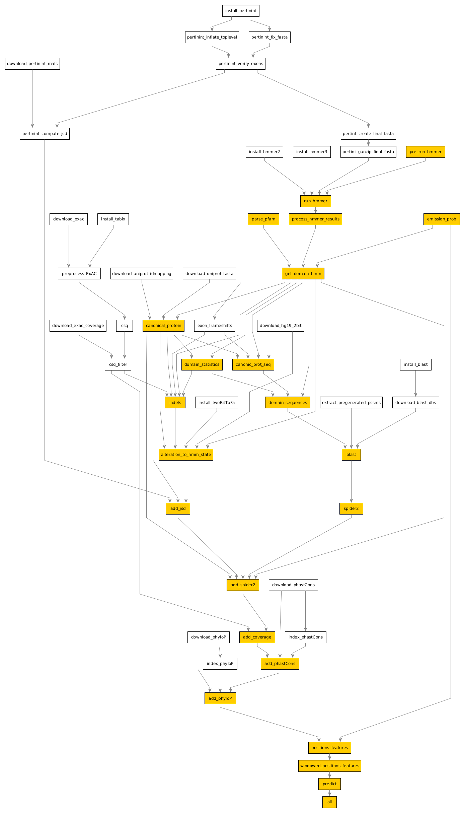

## Running Snakemake rules

Now that all the required data is copied over and tools we'll need installed, it's time
to run the Snakemake rules for the input file `input.hmm`. These rules are run on compute nodes
in a cluster environment.

At this point you will likely want to inspect the *profile file* `config.yaml` to see if you need
to customize it for your cluster. The included `config.yaml` should work out of the box
for clusters that use [Slurm](https://slurm.schedmd.com/documentation.html), and we have tested it
out on a couple of clusters at the time of this  writeup. In particular, the `--cluster` section may
need to be tweaked. See the official
[Snakemake documentation](https://snakemake.readthedocs.io/en/stable/executing/cli.html#all-options)
on all the possible options that can be specified in this file.
  
Once you have tailored this file to your situation, you can run the rules by executing:

```
snakemake --profile .
```

This step and can take a fair bit of time (an hour or so) the first time you run it. Jobs are submitted
to the cluster through the [sbatch](https://slurm.schedmd.com/sbatch.html) command, and you will see
the output of the jobs on your screen. When running these rules remotely on your cluster, you will want
to use something like [tmux](https://github.com/tmux/tmux/wiki) so that you can disconnect and return to
the terminal later.

Detailed log files for each rule executed are generated in the `logs` folder, with the  name of the rule
and a numerical suffix (the slurm job id). These are files to look at in case of any problems.

If all steps execute successfully, the output files are available in the `output` folder, with the
ligand-type and position-specific binding scores of each domain available in the `output/binding_scores.csv`
file.

## Running Snakemake rules for new domain(s)

Snakemake decides what rules to run depending on the modification timestamps on input/intermediate/output
files.

> :exclamation: If you decide the run the pipeline on a new `input.hmm` file (containing one or multiple domains),
save any existing files in the `output` folder to a secure location, as these files will be overwritten
when you re-run the rules.

Then execute `snakemake --profile . --dryrun` to see what rules will be executed.

In general, you should see a list of 46 jobs that need to run:
```
Job counts:
        count   jobs
        1       add_coverage
        1       add_jsd
        1       add_phastCons
        1       add_phyloP
        1       add_spider2
        1       all
        1       alteration_to_hmm_state
        1       blast
        1       canonic_prot_seq
        1       canonical_protein
        1       domain_sequences
        1       domain_statistics
        1       emission_prob
        1       get_domain_hmm
        24      indels
        1       parse_pfam
        1       positions_features
        1       pre_run_hmmer
        1       predict
        1       process_hmmer_results
        1       run_hmmer
        1       spider2
        1       windowed_positions_features
        46
```

These 46 jobs correspond to following 23 unique rules (in orange) that are run each time you modify the `input.hmm`
file.



For the [ig](https://en.wikipedia.org/wiki/Immunoglobulin_domain) domain that is included in the default `input.hmm`
file, these steps take around 20-25 minutes in our testing. Longer or multiple domains can be expected to take a
proportionally longer time to execute.